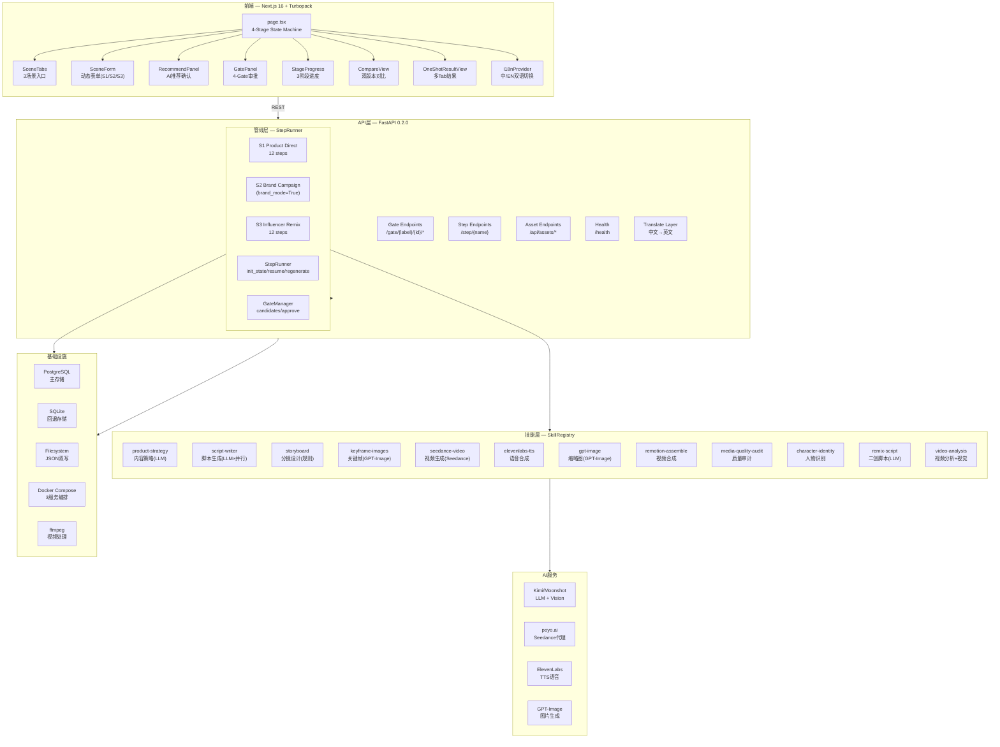
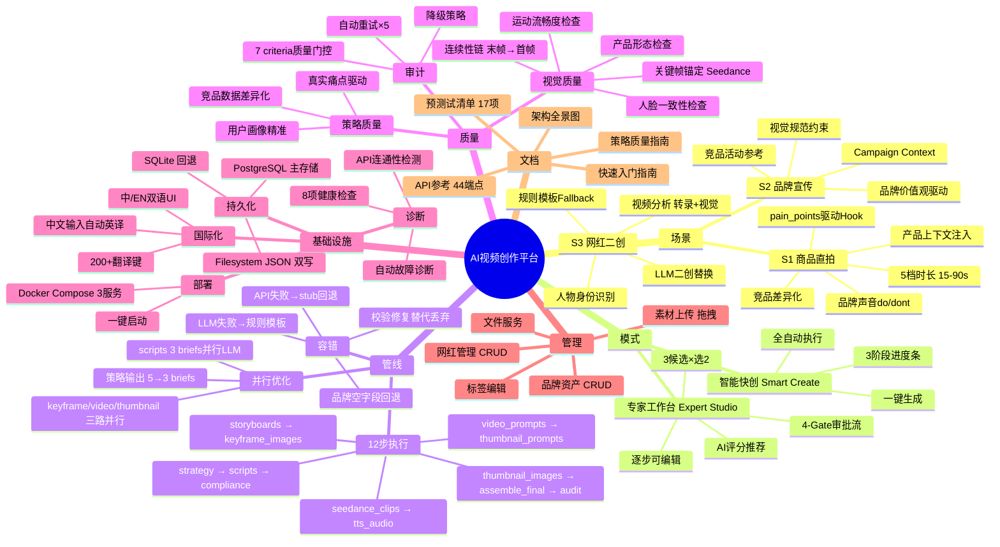

# AI 视频创作平台 — 产品架构全景图

> 角色：产品经理 | 日期：2026-04-29 凌晨
> 基于 v3 执行计划全部落地后的最终产品形态

---

## 一、产品架构图

---

## 二、数据流图

```mermaid
flowchart LR
    subgraph Input["用户输入"]
        PN["产品名称"]
        USP["核心卖点"]
        CT["品类"]
        US["使用场景"]
        PP["痛点"]
        TA["目标用户"]
        CC["竞品差异"]
        BV["品牌声音 do/dont"]
    end

    subgraph Scene["场景选择"]
        S1_ENTRY["S1 商品直拍"]
        S2_ENTRY["S2 品牌宣传"]
        S3_ENTRY["S3 网红二创"]
    end

    subgraph Translate["翻译层"]
        ZH_DETECT["中文检测<br/>has_chinese()"]
        LLM_TRANS["LLM翻译<br/>translate_to_english()"]
    end

    subgraph Strategy["策略生成"]
        S1_PROMPT["Product Context<br/>STRATEGY_SYSTEM_PROMPT"]
        S2_PROMPT["Campaign Context<br/>STRATEGY_SYSTEM_PROMPT_BRAND"]
        BRIEFS["3 Briefs<br/>{video_type, topic, hook, ...}"]
    end

    subgraph Content["内容生成"]
        SCRIPTS["Scripts<br/>LLM并行×3"]
        STORYBOARD["Storyboards<br/>规则分镜"]
        KEYFRAMES["Keyframes<br/>GPT-Image"]
        VIDEOS["Seedance Clips<br/>image_to_video"]
        AUDIO["TTS Audio<br/>ElevenLabs/stub"]
        THUMBS["Thumbnails<br/>GPT-Image"]
    end

    subgraph Assembly["合成与审计"]
        ASSEMBLE["Assemble<br/>Remotion/ffmpeg"]
        AUDIT["Audit<br/>7 criteria"]
        OUTPUT["Output<br/>final_video.mp4"]
    end

    subgraph State["状态持久化"]
        STATE_MANAGER["PipelineStateManager<br/>双写"]
        PG_DB["PostgreSQL"]
        FS_JSON["Filesystem JSON"]
        SQLITE_DB["SQLite fallback"]
    end

    Input --> Scene
    Scene --> Translate
    ZH_DETECT -->|含中文| LLM_TRANS
    ZH_DETECT -->|纯英文| Strategy
    LLM_TRANS --> Strategy
    
    S1_ENTRY --> S1_PROMPT
    S2_ENTRY --> S2_PROMPT
    S3_ENTRY -->|remix_script路径| Content
    
    S1_PROMPT --> BRIEFS
    S2_PROMPT --> BRIEFS
    BRIEFS --> SCRIPTS
    SCRIPTS --> STORYBOARD
    STORYBOARD --> KEYFRAMES
    KEYFRAMES --> VIDEOS
    SCRIPTS --> AUDIO
    STORYBOARD --> THUMBS
    
    VIDEOS --> ASSEMBLE
    AUDIO --> ASSEMBLE
    THUMBS --> ASSEMBLE
    ASSEMBLE --> AUDIT
    AUDIT --> OUTPUT

    Strategy --> State
    Content --> State
    Assembly --> State
    State --> STATE_MANAGER
    STATE_MANAGER --> PG_DB
    STATE_MANAGER --> FS_JSON
    STATE_MANAGER -.->|fallback| SQLITE_DB
```

---

## 三、业务流程图

### 3.1 三条业务线

```mermaid
flowchart TB
    subgraph S1_FLOW["S1 商品直拍 — Product Showcase"]
        S1_IN["输入: 产品名 + USP + 上下文"]
        S1_AI["AI推荐: 时长 + 平台 + 策略"]
        S1_MODE{"模式?"}
        S1_SMART["智能快创<br/>3阶段全自动"]
        S1_EXPERT["专家工作台<br/>4-Gate审批"]
        S1_OUT["输出: 可发布mp4"]
        
        S1_IN --> S1_AI
        S1_AI --> S1_MODE
        S1_MODE -->|Smart| S1_SMART
        S1_MODE -->|Expert| S1_EXPERT
        S1_SMART --> S1_OUT
        S1_EXPERT --> S1_OUT
    end

    subgraph S2_FLOW["S2 品牌宣传 — Brand Campaign"]
        S2_IN["输入: 品牌资产 + 活动 + 上下文"]
        S2_AI["AI推荐: 品牌策略 + 平台"]
        S2_MODE{"模式?"}
        S2_OUT["输出: 品牌宣传片"]
        
        S2_IN --> S2_AI
        S2_AI --> S2_MODE
        S2_MODE -->|Expert默认| S2_OUT
    end

    subgraph S3_FLOW["S3 网红二创 — Influencer Remix"]
        S3_IN["输入: 视频URL + 产品 + 上下文"]
        S3_ANA["视频分析: 转录 + 视觉帧"]
        S3_FACE["人物识别: 人脸检测"]
        S3_REMIX["内容二创: LLM替换"]
        S3_MODE{"模式?"}
        S3_OUT["输出: 二创视频"]
        
        S3_IN --> S3_ANA
        S3_ANA --> S3_FACE
        S3_FACE --> S3_REMIX
        S3_REMIX --> S3_MODE
        S3_MODE -->|Expert默认| S3_OUT
    end
```

### 3.2 专家工作台 Gate 审批流

```mermaid
flowchart LR
    START([开始生成]) --> G1

    subgraph G1["Gate 1: 选脚本"]
        G1_GEN["生成3个候选<br/>standard/creative/conservative"]
        G1_SCORE["AI评分 ★ 推荐"]
        G1_SEL["用户选择1-2个"]
        G1_EDIT["可编辑"]
    end

    G1 --> G2

    subgraph G2["Gate 2: 审画面"]
        G2_GEN["每Shot生成关键帧"]
        G2_CHECK["质量检查<br/>人脸一致性/产品形态"]
        G2_APPROVE["审批或重新生成"]
    end

    G2 --> G3

    subgraph G3["Gate 3: 选片段"]
        G3_GEN["每Shot生成3个候选Clip"]
        G3_SCORE["AI评分 ★ 推荐"]
        G3_SEL["选择最优Clip"]
    end

    G3 --> G4

    subgraph G4["Gate 4: 终审"]
        G4_COMPARE["双版本对比<br/>(如果Gate1选了2个)"]
        G4_REVIEW["完整视频预览"]
        G4_QA["质量摘要"]
        G4_ACTION["下载/发布/重做"]
    end

    G4 --> DONE([完成])
```

---

## 四、产品功能全景图

---

## 五、技术指标

| 指标 | 数值 |
|------|------|
| **Python文件** | 78个, 全部py_compile通过 |
| **前端组件** | 25+个, tsc --noEmit零错误 |
| **API端点** | 44个, 前后端一致 |
| **管线步骤** | 12步, S1/S2/S3共享引擎 |
| **注册Skill** | 15个, 每个有fallback链 |
| **策略配置** | 4套 (general/product_direct/brand_campaign/influencer_remix) |
| **i18n翻译键** | 677个, zh/en双语 |
| **Gate审批节点** | 4个, 每节点3候选 |
| **时长档位** | 5档 (15/30/45/60/90s) |
| **降级链路** | 5条 (PG→SQLite, API→stub, LLM→fallback, Seedance→ffmpeg, 校验→修复) |

---

*文档版本: v1.0 | 下次更新: 测试后*
