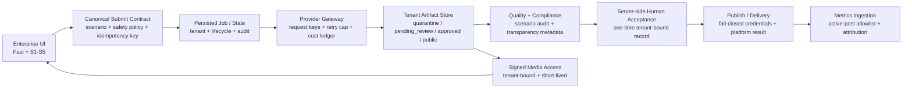

# 企业 AI 图文视频全场景收敛设计

## 1. 决策与目标

本轮把产品收敛为企业级 AI 内容生产平台，而不是单一短视频工具。交付范围覆盖：

- 文本：策略、脚本、标题、字幕、发布文案、审核记录；
- 图片：关键帧、缩略图、品牌素材、中间产物；
- 音频：TTS、配音及合成输入；
- 视频：Fast Mode 与 S1–S5 的片段、合成视频和发布产物；
- 业务闭环：租户隔离、成本控制、质量审计、人工验收、透明度标记、发布、指标回流。

目标场景为 Fast Mode、S1 商品直拍、S2 品牌营销、S3 达人混剪、S4 实拍素材、S5 品牌 VLOG。每个场景最终都必须通过相同的企业级安全与验收门，而不是各自拥有一套相互漂移的例外规则。

用户已明确要求覆盖全部企业 AI 图文和视频、打通所有场景并开始执行，因此本设计采用风险优先的全场景分波次路线。项目契约高于 Superpowers 的默认 commit/worktree 建议：使用当前 checkout 的 `codex/enterprise-ai-content-closure-20260711` 分支，不自动 commit，不创建 worktree。

## 2. 当前证据基线

2026-07-11 在 `c7a00b0710563b141ab21ed2152de12ba884f5e7` 上重新验证：

- 后端 hermetic suite：`2076 passed, 11 skipped, 12 deselected`；
- 前端：ESLint、TypeScript、Vitest `60 files / 256 tests`、Next build 通过；
- CodeGraph：728 files、12,367 nodes、25,906 edges，索引最新；
- 生产只读：主要页面和 health 可达，PostgreSQL、Remotion、ffmpeg、Chromium 与媒体工具健康；
- 证据上限：本轮默认仅允许本地代码、fixture、构建和生产只读检查。provider、deploy、publish、delivery、生产数据库写入均需另行精确授权。

上述绿色基线不覆盖 PostgreSQL 18 完整 round-trip、生产 Python 3.14 测试、默认排除的 `hermetic_slow`、真实 provider、真实发布与外部 webhook。

## 3. 路线比较与选择

### 3.1 路线 A：一次性大爆炸收敛

同时修改安全、场景、发布、数据库、部署和合规，再做一次总验收。优点是表面周期短；缺点是改动相互干扰、回归定位困难，任何一个外部依赖都会阻塞全部交付。拒绝采用。

### 3.2 路线 B：风险优先、全场景分波次收敛（采用）

先建立所有场景共用的安全与成本不变量，再修正确性和数据一致性，然后收敛运维、合规和逐场景真实证据。每一波都产生可独立审查、可回滚、可验证的软件。该路线能优先封住租户媒体暴露、重复计费和真实调用失控，同时仍保证最终覆盖全部场景。

### 3.3 路线 C：逐场景纵向打通

先完整打通 S1，再依次复制到 S2–S5 和 Fast Mode。优点是较早得到一个完整 demo；缺点是当前高风险缺口集中在共享层，先做场景会把媒体访问、重试、成本和发布错误复制六次。拒绝作为主路线；Wave 5 的逐场景验收仍采用纵向切片。

## 4. 目标架构

### 4.1 统一提交契约

Fast 与 S1–S5 统一携带以下控制信息：

- `tenant_id`：只从服务端认证上下文取得，请求体不得自报；
- `idempotency_key`：一次用户动作对应一个稳定键；
- `enable_media_synthesis`：是否允许进入图片、音频或视频 provider；
- `artifact_disposition`：只允许 `quarantine`、`pending_review`、`approved`、`public` 的受控迁移；
- `provider_max_retries`：调用层重试上限，token smoke 必须为 `0`；
- `budget_limit`：服务端持久化预算，不信任浏览器自报的已消费金额；
- `transparency_policy`：标记与交付门策略；
- `commercial_injection_plan`：沿用当前商业注入合同。

后端是这些字段的单一事实源。前端 helper、blocking endpoint 与 unified async endpoint 必须通过同一规范化函数构造 config。

### 4.2 生命周期与成功语义

统一生命周期为：

`queued -> running -> degraded|failed|pending_review -> accepted|rejected -> published|delivery_accepted`

规则：

- `success=true` 只能由场景必需步骤、必需产物、`pipeline_degraded` 和错误集合共同派生；
- bounded/no-media 运行可被标记为 `completed_bounded`，不得伪装成完整媒体成功；
- fixture/mock 结果必须携带 `simulated=true`，不得写入 `published`；
- 任何 timeout、静止 polling、认证缺失、签名异常或 provider 返回不确定状态都 fail-closed；
- 前端只信任后端生命周期，不使用本地硬编码步骤提前宣告完成。

### 4.3 租户产物与媒体访问

产物分为两类：

1. `public`：显式经人工验收和发布策略批准的最终产物，可由独立 public 路径缓存；
2. `protected`：uploads、renders、quarantine、pending_review、tenant final work 和所有中间产物。

protected media 必须经后端验证租户所有权。短期签名包含 canonical path、tenant、expiry 和用途；签名生成接口先验证路径属于当前租户。Nginx 不得直接 `alias` 整个 `backend_output`，只允许显式 public 根目录走静态缓存，其余 `/api/media/*` 反向代理到后端。

跨租户读取使用 `404`，避免泄露资源是否存在；未认证使用 `401/403`。兼容期内旧全局路径仅对默认租户的已批准 public 资产开放，不为 pending-review 建立匿名兼容例外。

### 4.4 Provider、重试与成本

- GET/HEAD 等只读请求可按现有退避策略重试；mutation 默认零自动重试；
- mutation 只有携带服务端认可的 idempotency key 才能安全重放；
- Recommendation 页面不得在用户点击生成前静默创建付费 pipeline；
- request-scoped key 必须被所有 provider client 消费，禁止部分 client 回退模块级 key；
- 每次 provider attempt 写入持久化 cost ledger，记录 tenant、job、provider、model、media type、计费单位、attempt、结果和外部 task id；
- hard budget 在 provider submit 之前原子预留，成功后结算，明确失败释放；进程重启后预算仍有效；
- token smoke 只能运行审批计划 allowlist 中的单个 spec，固定 `workers=1`、`retries=0`、submit/job cap 和 pending-review-only。

### 4.5 人工验收、发布与指标

发布请求不得通过请求体自证“人工已批准”。服务端持久化 acceptance record，至少绑定 tenant、artifact、scenario、reviewer identity、decision、expiry 和 single-use nonce。发布消费后不可复用。

平台 credential 缺失时 fail-closed；fixture/mock connector 返回 `simulated=true`，不得创建 published 记录。真实平台回执保存 provider post id、timestamp 和可验证状态。

指标回流只接受已发布 active post allowlist。平台 mapping、post-level attribution 和拉取窗口进入合同测试；没有 active post 时保持 `METRICS_PULL_ENABLED=false`。

### 4.6 数据与运行时

- production 配置 PostgreSQL 后，连接、migration 或 required-table 检查异常必须使 readiness 非 2xx，并阻止应用进入 ready；
- SQLite fallback 仅限显式 development/test 模式；
- fresh PostgreSQL 18 bootstrap 与历史升级路径都必须有 disposable DB 验证；
- `regenerate_chain`、`soft_degraded_reasons` 等审计字段必须在 schema、repository、state manager、filesystem fallback 和 API projection 中往返一致；
- quality-score rewind 使用有界状态机，不在静态 `for` 循环内仅修改 `current_step`；
- 生产 Python、依赖锁、CI 测试解释器和镜像实际运行时保持一致。

### 4.7 可观测性、灾备与部署

- Prometheus rules、Grafana queries 与 exporter 通过静态合同和 `promtool`；合成告警必须能触达通知渠道并验证恢复通知；
- 完整备份加密复制到 off-host versioned/immutable 存储；新增表必须自动纳入或使备份 fail-closed；
- manifest 记录 Git SHA、migration head、source hash、immutable image digest 和所有 artifact checksum；
- deploy 使用 CI 构建并验证的 immutable images，生产不 bind-mount live source；
- tag 必须来自受保护 main 的祖先，SSH known_hosts 固定指纹；先产出 dry-run deletion artifact，再由 reviewer 批准 live job；
- canonical wrapper 默认 dry-run，非法 `DRY_RUN` 值立即退出。

### 4.8 透明度与 C2PA

工程目标是满足企业可审计的 AI 内容透明度，不把 C2PA 表述为唯一法律方案。默认策略：

- 文本、图片、音频、视频均生成透明度 sidecar，记录生成模型、时间、编辑链和来源；
- UI 和发布 metadata 提供可见的 AI-generated label；
- 支持格式的图片/视频嵌入 C2PA Content Credentials；
- EU 范围由负责人和法律确认。确认前，EU publish/delivery 保持 blocked；
- 若策略要求签名，缺证书、SDK、签名异常或独立验证未通过时交付 fail-closed；
- 证书与私钥只通过 secret mount/HSM/KMS 注入，不进入仓库、日志、备份正文或测试 fixture。

## 5. 分波次实施

### Wave 0：基线与控制面

产出总设计、全量路线图、详细 Wave 1 计划、当前 HEAD 证据和授权边界。该波不执行 provider、deploy、publish 或生产写入。

### Wave 1：P0 安全与成本止血

依次闭环：

1. protected media tenant auth 与 Nginx 边界；
2. Fast/S1–S5 safety policy 完整透传；
3. mutation 零自动重试与 S1 推荐/生成去重；
4. token-smoke workflow 审批、allowlist、预算和单提交门；
5. 发布 acceptance record 与 credential fail-closed；
6. provider cost ledger 的正确单位与持久化预算基础。

Wave 1 结束前，任何 provider 扩大运行和真实发布保持 blocked。

### Wave 2：运行正确性与数据一致性

闭环 degraded/success 语义、PG fail-fast/readiness、PG18 bootstrap、审计字段 round-trip、quality-score rewind、request-scoped provider keys、S4 completion、Gate polling 和 S5 六图输入。

### Wave 3：可复现构建、可观测性与灾备

闭环生产解释器/锁依赖、类型门、Prometheus/Grafana、真实告警通知、off-host immutable backup、主机丢失恢复演练、canonical atomic deploy 和 GitHub provenance。

### Wave 4：透明度、C2PA、文档与体验

闭环 owner/legal scope、透明度 sidecar/label、全 producer C2PA、独立验证、i18n、accessibility、mobile review、版本 SSOT、canonical runbooks 与历史文档归档。

### Wave 5：Fast 与 S1–S5 纵向验收

每个场景依次通过：no-provider contract、bounded single-submit、pending-review artifact、质量审计、HU-03 人工评审、透明度验证、受控媒体生成、acceptance、publish/delivery 和 active-post metrics。每次真实外部动作使用单独授权记录，不因前一个场景获批而自动授权下一个场景。

### Wave 6：企业级容量与发布接受

执行租户并发、限流、队列/重启恢复、成本账本对账、备份恢复、告警演练和完整发布接受。只有全部硬门通过，才能声明企业全场景生产闭环。

## 6. 场景验收矩阵

| 场景 | 必需文本 | 必需媒体 | 必需人工门 | 完整成功证据 |
|---|---|---|---|---|
| Fast | prompt normalization、生成说明 | 目标视频，可选 TTS | pending-review acceptance | 单提交、预算内、签名/label、可下载且租户隔离 |
| S1 | strategy、scripts、compliance | keyframes、clips、TTS、thumbnail、assembled video | Gate + HU-03 | audit 通过、无 degraded、accepted artifact |
| S2 | brand strategy、campaign script | brand media、clips、TTS、thumbnail、assembled video | brand reviewer + HU-03 | 品牌规则、透明度和发布门全部通过 |
| S3 | source analysis、remix script | source-derived storyboard、clips、audio、assembled video | rights/source review + HU-03 | 来源记录、策略允许、accepted artifact |
| S4 | live-shoot script、prompt | uploaded footage refs、clips、TTS、thumbnail、assembled video | footage ownership + HU-03 | 不提前完成、素材身份连续、accepted artifact |
| S5 | vlog strategy、multi-model script | 六视图产品输入、clips、TTS、assembled video | model/product review + HU-03 | 六图合同、角色连续、accepted artifact |

共用门：tenant isolation、idempotency、retry cap、budget、audit、artifact disposition、transparency、acceptance、publish truth、metrics attribution。

## 7. 测试与证据策略

### 7.1 TDD 顺序

每个行为改动严格执行：

1. 写一个最小回归测试；
2. 运行并确认因目标缺口而红；
3. 写最少实现；
4. 聚焦测试转绿；
5. 运行直接相关 suite、lint/typecheck；
6. 独立 task review 同时通过 spec compliance 与 code quality；
7. 波次结束运行全量 backend/frontend/build gate。

### 7.2 证据分层

| 等级 | 允许声明 |
|---|---|
| L0 | 静态设计、代码审查、配置解析 |
| L1 | unit/fixture/mocked transport |
| L2 | 本地 integration、disposable PG18、构建、dry-run |
| L3 | 生产只读 health、route、log、配置摘要 |
| L4 | 精确授权的 provider、生产写入、deploy、publish、webhook send |
| L5 | 真实用户/品牌验收、平台可见发布、delivery accepted、指标回流 |

L1/L2 不得替代 L4/L5。HTTP 200 不等于业务成功；mock `published` 不等于平台发布；签名函数返回路径不等于独立 C2PA 验证通过。

## 8. 错误处理与回滚

- 所有安全、预算、审批、签名和发布门 fail-closed；
- 只读展示可 soft-degrade，但必须带结构化 reason；
- 每个数据迁移先在 disposable PG18 演练，提供 down/restore 或前向修复策略；
- artifact 状态迁移 append-only 记录，禁止静默覆盖审核证据；
- 部署按 immutable digest 回滚，备份恢复按独立校验 manifest 回滚；
- 同一缺口连续三次修正仍未通过时停止 patch，回到架构审查。

## 9. 外部授权门

以下工作即使路线图已到达，也必须再次取得精确授权：

- 任何付费 provider 生成；
- 任何生产数据库写入、迁移或 key 生命周期变更；
- Lighthouse/GitHub live deploy；
- TikTok/Shopify 真实发布；
- 外部 webhook send、delivery acceptance；
- 生产 active-post metrics pull；
- C2PA 证书申请、私钥/HSM/KMS 接入；
- off-host backup 首次真实上传与恢复演练。

授权必须写明样本、预算、次数、retry cap、artifact disposition、停止条件和证据保存位置。“继续下一步”不扩展为上述授权。

## 10. 完成定义

只有同时满足以下条件，项目才能声明“企业 AI 图文视频全场景闭环”：

- Fast 与 S1–S5 全部通过共用安全合同和各自场景合同；
- protected media 无匿名/跨租户读取路径；
- mutation、provider retry、预算和 idempotency 可审计且重启后有效；
- degraded、bounded、fixture、published、delivery 等状态语义真实；
- PostgreSQL、审计字段、质量回退与恢复链经 PG18 验证；
- production build 可复现、告警可触达、off-host 恢复可执行、deploy 可回滚；
- 透明度策略由 owner 确认，所有 in-scope 产物通过对应标记/验证；
- 每个场景均有 L4 受控样本，目标发布场景有 L5 人工和平台证据；
- 全量测试、lint、typecheck、build、security contracts 与最终独立 review 通过；
- 文档、版本、运行配置和 acceptance record 指向同一事实源。
