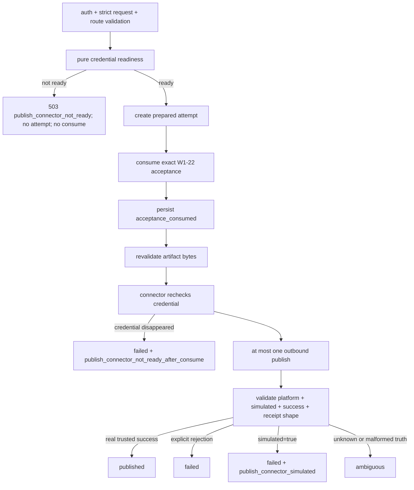

# W1-24 发布连接器真实性与 fail-closed 设计

## 1. 决策摘要

本规格只闭环路线图 W1-24：TikTok/Shopify 发布连接器在 credential 缺失、模拟结果、上游不确定结果和状态查询失败时必须 fail-closed，且模拟结果绝不能写成 `published`。

用户已经逐节批准以下决策：

1. 采用窄分层强化方案 A，不引入运行时 mock 开关，不重写发布架构；
2. 真实 connector 缺 credential 时直接失败，测试模拟只允许通过 dependency injection；
3. 所有 connector 发布结果必须携带精确 `bool` 类型的 `simulated`；真实 connector 只能返回 `false`，注入的测试模拟返回 `true`；
4. 显式、可验证的平台拒绝归类为确定性 `failed`；已经发出外部 mutation 后发生 timeout、disconnect、响应解析失败或无法确认结果的异常归类为 `ambiguous`；
5. `simulated=true` 若穿透到发布服务，使用稳定错误码 `publish_connector_simulated`，attempt 进入 `failed`，HTTP 返回 `502`，acceptance 保持已消费且不可重试；
6. credential 在 readiness 通过后、connector 调用前消失时，connector 不发网络请求，attempt 进入 `failed`，使用 `publish_connector_not_ready_after_consume`，HTTP 返回 `502`，不恢复 acceptance；
7. W1-24 同时收敛 `GET /distribution/status/{platform}/{post_id}`：缺 credential 返回 `503`，上游/解析/结构异常返回 `502`，绝不回退本地 mock `published`；
8. 保留 `PublishEngine` 兼容层，但移除其吞掉 connector 异常并伪装为普通失败的 broad catch；
9. 本项不新增数据库状态、表、字段或 migration，只扩展现有 publish error-code allowlist；
10. Shopify credential 继续按 `SHOPIFY_ACCESS_TOKEN` 优先、`SHOPIFY_API_KEY` legacy fallback 读取，env 单一事实源重构留给 W1-25；
11. 本项不执行真实 connector、provider、生产数据库、SSH、部署、发布、交付或 metrics live pull。

## 2. 背景与当前事实

### 2.1 W1-23 已提供的边界

W1-23 已经完成本地 acceptance-backed publish transaction：

- `POST /distribution/publish` 与 deprecated `POST /publish/{video_id}` 共用 `PublishAttemptService`；
- 一条 acceptance 只授权一个平台和一个 attempt；
- readiness 在 consume 之前执行；
- acceptance consume 后不自动重试、不恢复；
- attempt 状态支持 `prepared`、`authorization_failed`、`acceptance_consumed`、`published`、`failed`、`ambiguous`；
- 当前证据只有 fake connector 与 disposable PostgreSQL 18，本地状态为 `completed_local`；
- 真实 connector truth、真实 receipt 与 live publish 明确留给 W1-24、W1-25 和 W1-26。

因此 W1-24 不重建 acceptance、attempt ledger 或路由授权，只修复 connector 与服务消费 connector 结果时的真实性缺口。

### 2.2 当前实现的真实缺口

仓库审计确认：

- `TikTokConnector.publish()` 在 `TIKTOK_ACCESS_TOKEN` 缺失时调用 `_mock_publish()`，生成 `tt_mock_*`，并返回 `success=true`、`status=published`；
- `ShopifyConnector.publish()` 在 token 或 store 缺失时调用 `_mock_publish()`，生成 `sp_mock_*`，并返回 `success=true`、`status=published`；
- 两个 connector 的 `get_status()` 都会在 credential 缺失或异常时返回本地 mock `published`；
- `inspect_publish_readiness()` 通过 `_is_mock_mode()` 判断 credential，但 connector 执行时仍会重新进入 mock fallback，readiness 和执行不是同一事实源；
- connector 公开发布结果没有 `simulated` 字段；
- 两个 connector 的若干 broad catch 把 timeout、disconnect、响应解析异常和未知异常压缩为 `success=false`，服务无法区分确定性拒绝和结果不确定；
- `PublishAttemptService` 只校验 `success`、可选 `platform`、`post_id` 和 `url`，忽略模拟真实性；
- `/distribution/status` 把 connector 异常压成通用 `500`，同时 connector 内部又可能把异常变成本地 mock 成功；
- 未被 W1-23 路由调用的 `PublishEngine` 仍捕获全部异常、记录 traceback，并把原始异常文本写入 `PublishResult.error`。

这些行为会让“credential 未配置”“上游结果未知”或“纯本地模拟”被错误表示为平台已发布，违反总设计的生命周期真实性要求。

## 3. 官方平台合同约束

本规格只采用官方一手文档作为外部行为依据：

- TikTok Content Posting API 要求注册应用、启用 Direct Post、获得 `video.publish` scope，并使用目标用户授权的 access token；本地文件 direct post 是异步流程，需要使用返回的 `publish_id` 查询状态：[TikTok Get Started](https://developers.tiktok.com/doc/content-posting-api-get-started)、[TikTok Direct Post API](https://developers.tiktok.com/doc/content-posting-api-reference-direct-post?enter_method=left_navigation&from_seo_redirect=1)。
- Shopify Admin GraphQL 示例通过 `X-Shopify-Access-Token` 调用 `stagedUploadsCreate` 与 `fileCreate`；视频上传使用 staged target，文件处理具有异步状态：[stagedUploadsCreate](https://shopify.dev/docs/api/admin-graphql/latest/mutations/stageduploadscreate)、[fileCreate](https://shopify.dev/docs/api/admin-graphql/latest/mutations/filecreate)、[FileStatus](https://shopify.dev/docs/api/admin-graphql/latest/enums/FileStatus)。
- Shopify Admin API 的文件读写由 `read_files`/`write_files` scope 控制：[Shopify access scopes](https://shopify.dev/docs/api/usage/access-scopes)。

由此得到的工程约束是：credential 缺失不能被模拟成功替代；平台 mutation 的 transport/acknowledgement 不确定不能伪装为明确失败或成功；异步状态允许真实 `unknown`，但不允许本地虚构 `published`。

W1-24 不宣称当前 TikTok endpoint 实现或 Shopify receipt 已完全符合最新官方 API；endpoint、scope、receipt/post truth 的完整校准仍属于 W1-25/W1-26。W1-24 只确保现有路径不会在缺失事实时制造成功。

## 4. 目标、非目标与完成边界

### 4.1 目标

- readiness 与 connector 执行使用相同的 credential 判定逻辑；
- credential 缺失、空字符串、纯空白、Shopify partial configuration 在任何入口都 fail-closed；
- 运行时代码不再存在发布或状态 mock fallback；
- connector 结果对 `simulated` 采用精确类型合同；
- 服务端只在 `success=true`、`simulated=false` 且结果结构可信时进入 `published`；
- post-consume credential race、确定性失败、模拟穿透和不确定结果有互斥、稳定的状态与错误码；
- `/distribution/status` 只返回真实 connector 结果或稳定 fail-closed 错误；
- 保持现有 auth、acceptance、attempt transaction、数据库 schema、前端调用和 metrics 边界不变；
- 通过无网络、依赖注入、focused/full regression 与本地主线程复审形成可重复证据。

### 4.2 非目标

- 不统一或删除 `SHOPIFY_API_KEY` legacy env；
- 不校验 production credential 是否有效、scope 是否已授予、账户是否通过平台审核；
- 不修订全部 TikTok/Shopify API endpoint、upload protocol 或 GraphQL receipt 模型；
- 不建立 immutable artifact snapshot；
- 不新增 acceptance UI、publish UI 或 status UI；
- 不新增数据库表、字段、状态或 migration；
- 不执行真实平台 publish/status、sandbox publish、删除或回滚；
- 不把 metrics pull、delivery acceptance、W1-25 receipt truth 或 W1-26 live publish 合并进来。

### 4.3 证据上限

本项实现后的最高业务证据仍是本地静态、fixture、fake transport 和已有 disposable database regression。固定边界为：

- `production unchanged`
- `provider_call=false`
- `real_connector_call=false`
- `live_publish=false`
- `database_write=local-test-only`
- `external_status_call=false`

由于用户明确要求不使用子智能体，而路线图把 independent review 作为 `complete` 前置条件，本项在没有后续独立复核或明确规则调整时最高只能记录为 `implementation_complete_local / independent_review_pending`，不能标记 `completed_local`。验收报告必须显式记录 `independent_review=false`。

## 5. 核心不变量

### 5.1 Credential 不变量

1. readiness 是纯函数式、无网络、无文件写入检查；
2. connector 每次 `publish()` 和 `get_status()` 在创建 HTTP client 或读取视频文件之前重新执行相同 credential validator；
3. token 只检查“存在、类型正确、去除首尾空白后非空”，不打印、不返回、不记录内容；
4. TikTok 需要有效的 `TIKTOK_ACCESS_TOKEN`；
5. Shopify 需要有效 token 与有效 `SHOPIFY_STORE_URL`；token 读取顺序保持 `SHOPIFY_ACCESS_TOKEN`，然后 legacy `SHOPIFY_API_KEY`；
6. Shopify store 值必须是无 scheme、path、query、fragment、userinfo 和空白的 hostname；无效或 partial configuration 视为 not ready；
7. credential 不可用时不得构造 HTTP client，不得发送网络请求，不得生成 post ID/URL，不得返回 `published`。

### 5.2 模拟真实性不变量

1. connector 的公开 `publish()` 返回 mapping 时，必须存在 `simulated`，且 `type(value) is bool`；
2. 真实 TikTok/Shopify connector 的所有确定性成功和失败 mapping 都返回 `simulated=false`；
3. 运行时不再提供 `_mock_publish()`、`_mock_status()` 或等价 fallback；
4. 测试模拟只能由注入的 publisher/fake connector 提供，并必须返回 `simulated=true`；
5. `ALLOW_MOCK_MODE` 不得影响 publish readiness、connector publish 或 connector status；
6. 任何在 dependency composition/readiness 阶段已知为 simulated 的 connector 必须投影为 `ready=false`，在创建 attempt 和消费 acceptance 前阻断；
7. 服务遇到 `simulated=true` 绝不进入 `published`；
8. `simulated` 缺失、非 `bool` 或与结果结构矛盾时，结果不可信并进入 `ambiguous`，不能猜测为真实失败；
9. 只有 service 防御性测试可以故意组合 `ready=true` 与 injected simulated publisher，用于证明穿透保护；正式 runtime dependency 不允许这种组合。

### 5.3 单次外部副作用不变量

1. W1-23 的 readiness → prepared → consume → acceptance_consumed → connector 顺序不变；
2. W1-24 不增加任何自动重试；
3. connector helper 不得在 catch 中再次提交；
4. timeout、disconnect 或 acknowledgement 丢失后不自动重放；
5. acceptance consume 后的任何失败都不恢复 acceptance；
6. 同一个 `PublishAttemptService.execute()` 最多调用一次注入 publisher。

### 5.4 日志与响应不变量

- 不记录 token、credential 名值、请求/响应 body、绝对视频路径、产品名、平台原始错误文本或 traceback；
- 日志只允许稳定事件名、platform、attempt ID、trace ID、HTTP status 和 exception class；
- 对外只返回稳定 error code，不返回 provider body、GraphQL errors、transport message 或 exception string；
- status 路径遵守与 publish 路径相同的敏感信息边界。

## 6. 目标组件设计

### 6.1 `src/connectors/base.py`

新增最小 typed connector error vocabulary：

- `ConnectorCredentialNotReady`：调用开始时 credential 已不可用，且保证未发出外部请求；
- `ConnectorOutcomeAmbiguous`：已进入或可能进入外部 mutation 后，无法确认平台是否接受/执行；
- `ConnectorStatusUnavailable`：status 请求无法得到可信平台状态；
- `ConnectorCredentialState`：只携带 `ready: bool` 与稳定、无敏感信息的 `reason`。

错误对象不得保存 token、原始响应 body、视频路径或 provider message。`reason` 只使用稳定枚举，例如 `missing_credentials` 或 `invalid_configuration`。

`PlatformConnector` 的合同更新为：

- `publish()` 的确定性 mapping 必须含 `success`、`simulated`，并可含 `platform`、`post_id`、`url`、`status`；
- `get_status()` 的成功 mapping 必须含 `post_id`、`status`、`simulated=false`；
- 不确定 publish 通过 `ConnectorOutcomeAmbiguous` 暴露；
- status 不可用通过 `ConnectorStatusUnavailable` 暴露；
- credential 不可用统一通过 `ConnectorCredentialNotReady` 暴露。

### 6.2 TikTok 与 Shopify credential validator

每个平台模块只保留一个私有 credential validator；`registry.inspect_publish_readiness()` 与该 connector 的 `publish()`/`get_status()` 都调用它。禁止 readiness 使用 `_is_mock_mode()`、执行路径另写一套 token 判断。

validator 只读取 process environment，不读取 `.env` 文件，不访问网络，不探测 token 有效性。测试使用 `monkeypatch` 注入环境；任何测试值都是明确的非生产 fixture。

### 6.3 `src/connectors/registry.py`

`inspect_publish_readiness(platform)` 保持现有返回形状：

```text
platform + ready + reason
```

变化只有两点：

- 数据来源改为平台共享 credential validator；
- `reason` 不再包含 “mock mode” 概念。

`publish_to_platform()` 保持 connector factory 和单次调用边界，不捕获 typed connector exceptions。

### 6.4 TikTok connector

`publish()` 顺序：

1. 运行 credential validator；not ready 时抛 `ConnectorCredentialNotReady`；
2. 验证本地视频路径；缺失时返回确定性 `success=false, simulated=false`；
3. 执行现有 upload/publish 调用，保留当前请求次数和顺序；
4. 可解析、明确的平台拒绝返回确定性 `success=false, simulated=false`；
5. 在首次 outbound 之前发生的本地文件校验/读取失败属于确定性 failure；收到非 2xx 只有在平台响应能证明 mutation 未被接受时才属于明确拒绝，否则仍按 ambiguous 处理；
6. timeout、disconnect、响应 JSON 解析失败、成功响应缺失关键字段或其它无法确认 mutation 结果的异常抛 `ConnectorOutcomeAmbiguous`；
7. 只有结构可信的真实成功返回 `success=true, simulated=false`。

删除 `_mock_publish()`、`_mock_status()` 以及只为 mock 使用的 imports。任何 helper 都不得把 `ConnectorOutcomeAmbiguous` 再压成普通失败。

### 6.5 Shopify connector

`publish()` 使用与 readiness 相同的 token/store validator，并遵循与 TikTok 相同的确定性/不确定性分类。

现有 staged upload → fileCreate → 可选 product association 的调用顺序不在 W1-24 重构。明确 GraphQL/HTTP rejection 可返回 `success=false, simulated=false`；transport、parse 或结构不确定抛 `ConnectorOutcomeAmbiguous`。可选 association 的产品语义与最终 receipt 校准留给 W1-25，本项不把 ancillary association 失败扩大成新的事务模型。

删除 runtime mock fallback。`_headers()` 只能在 validator 已确认 credential 后被 publish/status 路径调用；缺 token 时不得退化为无认证请求。

### 6.6 `PublishAttemptService`

服务在 connector 调用后按以下固定顺序验证结果：

1. result 必须是 mapping；
2. `simulated` 必须存在且为精确 `bool`；
3. `simulated=true` 立即按 `publish_connector_simulated` 终止，不再要求或信任 `success`、platform、post ID 或 URL；
4. 仅当 `simulated=false` 时，才继续校验可选 `platform` 必须等于请求 platform；
5. `success` 必须存在且为精确 `bool`；
6. 只有 `simulated=false` 且 `success=true`，再经现有 `PublishAttemptResponse` 的 post ID/URL 校验通过，才持久化 `published`；
7. 其它分支按本规格的 outcome matrix 终止。

服务新增两条稳定 error code：

- `publish_connector_not_ready_after_consume`
- `publish_connector_simulated`

它们加入 `PublishAttemptErrorCode` 与 repository terminal-code allowlist，不新增状态或 schema。

### 6.7 `GET /distribution/status/{platform}/{post_id}`

路由保留现有 API-key auth 与 path。unsupported platform 继续返回现有 client error；本项不扩大 auth/permission 模型。

状态查询顺序：

1. connector 在发网络请求前复用 credential validator；
2. 缺 credential 抛 `ConnectorCredentialNotReady`；
3. timeout、disconnect、非 2xx、响应解析失败、GraphQL/API error 或结构不可信统一抛 `ConnectorStatusUnavailable`；
4. connector 只有在读取到可信平台响应时返回 mapping，并显式携带 `simulated=false`；
5. 平台真实返回 `unknown`/`PROCESSING` 等非终态是有效 200，不等于错误；
6. route 对 connector 结果再次校验 `simulated is False`、`post_id` 与请求值精确相等、`status` 为非空字符串，防御注入或未来实现漂移；
7. status 请求不读取或写入 publish attempt/acceptance/database。

HTTP 投影固定为：

| 情况 | HTTP | 稳定 code | 数据库动作 |
|---|---:|---|---|
| credential 缺失/无效 | 503 | `distribution_status_connector_not_ready` | 无 |
| 上游、解析或结构不可用 | 502 | `distribution_status_unavailable` | 无 |
| 可信真实状态，包括真实 `unknown` | 200 | 无 | 无 |

错误 envelope 使用 FastAPI 既有 `detail` 包装，正文只包含稳定 `code`，不暴露原始异常。成功响应保留现有平台字段并新增精确 `simulated=false`。

### 6.8 `PublishEngine`

`PublishEngine` 暂不删除，以免无证据破坏潜在外部调用。它必须：

- 删除 `publish_to_tiktok()` 与 `publish_to_shopify()` 的 broad `except Exception`；
- 不把 exception string 写入 `PublishResult.error`；
- 传播 typed credential/ambiguous errors；
- 为 `PublishResult` 增加精确 `simulated: bool`，unsupported-platform 本地失败取 `false`；
- 复用相同的 exact-bool result truth：`simulated=true` 返回 `success=false, simulated=true, error=publish_connector_simulated`，missing/non-bool truth 抛 `ConnectorOutcomeAmbiguous`，不能把模拟结果转换为 success；
- 保持 unsupported platform 的本地确定性失败和平台顺序行为。

`PublishAttemptService` 仍直接通过 registry 调用单平台 connector；W1-24 不重新接入 multi-platform `PublishEngine`。

## 7. 发布数据流与错误语义

### 7.1 主数据流



### 7.2 Publish outcome matrix

| Connector/服务观察 | attempt 状态 | error code | HTTP | acceptance | retry |
|---|---|---|---:|---|---|
| pre-consume readiness false | 不创建 attempt | `publish_connector_not_ready` | 503 | 未消费 | 允许在 credential 修复后重新提交 |
| post-consume credential race；保证零 outbound | `failed` | `publish_connector_not_ready_after_consume` | 502 | 已消费 | 禁止 |
| `simulated=false` + `success=false` + 确定性拒绝 | `failed` | `publish_connector_failed` | 502 | 已消费 | 禁止 |
| `simulated=true`，不论 `success` | `failed` | `publish_connector_simulated` | 502 | 已消费 | 禁止 |
| `simulated` 缺失或非 bool | `ambiguous` | `publish_outcome_ambiguous` | 502 | 已消费 | 禁止 |
| `success` 缺失或非 bool | `ambiguous` | `publish_outcome_ambiguous` | 502 | 已消费 | 禁止 |
| platform 矛盾、receipt 结构不可信 | `ambiguous` | `publish_outcome_ambiguous` | 502 | 已消费 | 禁止 |
| timeout、disconnect、parse failure、unknown post-mutation error | `ambiguous` | `publish_outcome_ambiguous` | 502 | 已消费 | 禁止 |
| `simulated=false` + `success=true` + 可信结构 | `published` | 无 | 200 | 已消费 | 禁止 |

`simulated=true` 被定义为确定性本地违规，因此进入 `failed` 而非 `ambiguous`。`simulated` 缺失/类型错误无法证明是否真实，因此进入 `ambiguous`。

### 7.3 Connector exception 映射

- `ConnectorCredentialNotReady` 在 service connector invocation 阶段只映射为 `publish_connector_not_ready_after_consume`；
- `ConnectorOutcomeAmbiguous` 映射为 `publish_outcome_ambiguous`；
- 未分类 exception 继续作为 defensive ambiguous，不自动重试；
- terminal persistence 失败沿用 W1-23 的 `publish_attempt_state_unknown`，不伪造已持久化状态；
- 所有 post-consume 错误固定 `acceptance_consumed=true`、`retry_allowed=false`。

## 8. 兼容性设计

### 8.1 保持不变

- 两条 publish HTTP request shape、success response shape、auth 与 acceptance authority；
- 单平台单 attempt 与 no-retry transaction；
- publish attempt 状态集合和数据库 schema；
- `/distribution/platforms` 的平台列表结构；其 `connected` 改由共享 strict validator 计算；
- TikTok/Shopify connector factory 与 publisher dependency-injection seam；
- Shopify canonical-then-legacy token lookup；
- frontend publish/status helper 签名和现有 UI 调用；
- metrics connector 与 poller 的现有 fail-closed 行为。

### 8.2 有意的安全性破坏

- 缺 credential 的 direct connector publish 从“mock published”变为 typed error；
- 缺 credential 的 `/distribution/status` 从 200 mock `published` 变为 503；
- status 上游/解析失败从 mock/500 变为稳定 502；
- connector 公开 publish mapping 新增必填 `simulated`；
- 测试不得再依赖 `tt_mock_*`、`sp_mock_*` 或 mock URL。

这些变化是 W1-24 的目标，不提供 runtime compatibility flag。`ALLOW_MOCK_MODE=1` 仍可服务生成 pipeline 的其它既有 test/mock 边界，但不能解锁 publish/status。

### 8.3 W1-25 分界

W1-24 只确保“没有 credential 或真实性证据时不会写成功”。以下事项明确留给 W1-25：

- Shopify credential env 单一事实源与 legacy 迁移计划；
- provider post ID/URL/receipt 的更强格式、来源与持久化校验；
- E2E 对历史/外部 `mock` receipt 的完整拒绝合同；
- 当前 TikTok/Shopify API endpoint 与最新官方协议的逐项校准；
- 平台 status 与 publish receipt 的长期 reconciliation。

## 9. 测试策略

所有行为变更按 RED → 最小 GREEN → focused regression 顺序实施。真实网络构造在测试中默认禁止。

### 9.1 Credential truth RED

对 TikTok/Shopify 参数化覆盖：

- env 未设置；
- 空字符串；
- 纯空白；
- Shopify 只有 token；
- Shopify 只有 store；
- Shopify invalid store host；
- canonical token 优先于 legacy token；
- `ALLOW_MOCK_MODE=1` 不改变结果。

每个 case 同时验证 readiness、direct `publish()`、direct `get_status()` 一致，且 HTTP client construction count 为 0。

### 9.2 Runtime mock removal RED

静态和运行测试共同证明：

- connector source 不存在 `_mock_publish`、`_mock_status`、`tt_mock_`、`sp_mock_`、`mock-store` publish URL；
- credential 缺失不会 sleep、生成 UUID 或返回 success；
- publish/status 路径不读取 `ALLOW_MOCK_MODE`；
- 注入 fake publisher 是唯一模拟方式，并显式返回 `simulated=true`。

### 9.3 Connector result RED

真实 connector 的所有确定性 mapping 都断言 `simulated is False`：

- missing video；
- explicit HTTP/GraphQL rejection；
- upload failure；
- publish failure；
- trusted success；
- valid status success/processing/unknown。

timeout、disconnect、JSON parse failure、缺失关键 response field 与 helper unknown exception 必须抛对应 typed exception，不能返回普通 failure 或 mock success。

### 9.4 Service outcome matrix RED

在 `PublishAttemptService` 的 injected publisher seam 覆盖：

- trusted real success；
- deterministic real failure；
- `simulated=true` + success；
- `simulated=true` + failure；
- missing/non-bool `simulated`；
- missing/non-bool `success`；
- contradictory platform；
- unsafe/malformed post ID/URL；
- `ConnectorCredentialNotReady`；
- `ConnectorOutcomeAmbiguous`；
- timeout、disconnect、parse exception 与 generic exception。

每个 case 断言 attempt terminal state、error code、HTTP projection、`acceptance_consumed`、`retry_allowed`、connector call count 和 acceptance 不恢复。

### 9.5 Status route RED

ASGI/injected connector 测试覆盖：

- auth 仍生效；
- unsupported platform 保持既有 client error；
- missing credential → 503 `distribution_status_connector_not_ready`；
- timeout/disconnect/non-2xx/parse/shape → 502 `distribution_status_unavailable`；
- injected `simulated=true`、missing/non-bool simulated → 502；
- valid real `unknown`/processing/published → 200 且 `simulated=false`；
- 全部分支 database read/write count 为 0；
- error/log 不含 post ID 之外的 raw provider body、credential、path 或 exception message。

### 9.6 `PublishEngine` RED

测试证明：

- typed credential/ambiguous exceptions 传播；
- exception text 不进入 `PublishResult` 或日志；
- `simulated=true` 不转换成 success；
- unsupported platform 本地失败仍保持顺序；
- engine 不增加 retry 或第二次 connector call。

### 9.7 Regression gates

实现计划必须包含以下由窄到宽的验证：

1. connector truth/status focused tests；
2. publish attempt model/repository/service/route focused tests；
3. W1-22 acceptance 与 W1-23 publish regression；
4. metrics poller/connector regression；
5. Ruff 与静态 source guard；
6. backend `make ci`；
7. frontend Vitest、ESLint、TypeScript、OpenAPI drift 与 Next build；
8. `git diff --check`、placeholder scan、敏感信息 pattern scan、无临时产物检查；
9. 若 W1-23 disposable PostgreSQL 18 harness 可安全重用，运行 error-code/status transition regression；本项不得新增 migration，也不得访问生产数据库；
10. 主线程独立的两遍自审：第一遍按规格逐条 trace，第二遍按安全、异常、日志和兼容性审查；报告 `independent_review=false`。

## 10. 验收标准

### 10.1 功能验收

- 缺 credential 的 publish/status 从任何入口都不能返回 success/published；
- readiness 与执行 validator 对 unset/blank/whitespace/partial config 结果完全一致；
- connector 运行时代码无 mock publish/status fallback；
- 所有 connector publish mapping 有精确 `simulated`；
- service 只有真实可信成功能落 `published`；
- post-consume credential race、simulated leak、确定性 failure、ambiguous outcome 各自落入批准的唯一状态/error code；
- status 只返回真实响应或 503/502；
- `PublishEngine` 不吞异常、不泄露原始文本；
- 没有自动 retry、acceptance restore 或第二次 connector call。

### 10.2 数据与兼容验收

- 无新 migration、表、字段或 attempt 状态；
- 新 error code 只出现在批准的 error vocabulary 与 terminal allowlist；
- W1-22/W1-23 已有成功路径和单次消费并发不变量保持通过；
- frontend 无业务代码变更也能通过现有 build/test；
- metrics 不因 status 变更产生 active-post 写入或 mock 数据。

### 10.3 安全与证据验收

- 测试全程禁止真实 HTTP；
- 不读取 `.env` 或 key 文件；
- 不打印 credential、provider body、绝对媒体路径或异常文本；
- 不执行 SSH、production migration/deploy、real publish/status、provider、delivery 或 metrics pull；
- 最终报告列出 fresh commands/results、失败过但未采用的输出、文件 manifest、剩余 W1-25/W1-26 边界；
- 没有独立 reviewer 时状态停在 `implementation_complete_local / independent_review_pending`。

## 11. 文件影响边界

预计直接修改范围：

- `src/connectors/base.py`
- `src/connectors/registry.py`
- `src/connectors/tiktok_connector.py`
- `src/connectors/shopify_connector.py`
- `src/connectors/publish_engine.py`
- `src/models/publish_attempt.py`
- `src/services/publish_attempt.py`
- `src/storage/publish_attempt_repository.py`，仅 error-code allowlist
- `src/routers/distribution.py`
- 对应 connector、service、route、engine、metrics regression tests
- W1-24 规格、实施计划、runbook/roadmap/`.kiro`/SDD 状态记录

明确不改：

- migrations 与 fresh-init SQL；
- acceptance schema/service/API；
- frontend product components 与 UX；
- provider generation clients；
- metrics repository/poller 业务逻辑；
- production/deploy/SSH 配置；
- `.env`、`.env.prod`、`DDDD.pem` 或任何 secret 文件。

实施计划若发现必须越过此 manifest，必须暂停并重新走规格确认，不能把范围扩张隐藏在实现细节中。

## 12. 回滚与发布安全

本项当前只做本地实现，不部署生产，因此本轮回滚是恢复本项窄 manifest，不触碰既有 Wave 1A/W1-22/W1-23 dirty worktree。

未来若该变更获准部署，不能直接回滚到仍会 mock-publish 的旧应用版本，因为那会重新打开虚假 `published`。安全回滚顺序必须是：

1. 先在 gateway/route 层 fail-closed 阻断两个 publish mutation 与 distribution status；
2. 确认无 live mutation 在途；
3. 再回滚应用；
4. 保持 publish/status blocked，直到部署一个仍满足 W1-24 truth contract 的版本；
5. 对所有 `acceptance_consumed`/`ambiguous` attempt 只做人工 reconciliation，不自动重放。

数据库没有 W1-24 migration，因此不存在 schema downgrade。W1-23 已消费 acceptance 的事实不因应用回滚而改变。

## 13. 风险与缓解

| 风险 | 影响 | 缓解 |
|---|---|---|
| connector 内层 catch 继续吞掉 transport/parse exception | 确定性失败与 ambiguous 混淆 | typed exception RED 覆盖每个 helper 和 outer publish |
| readiness 与执行 credential 逻辑漂移 | consume 后才发现已知不可用 | 同一 validator + 参数化 parity test |
| fake result 忘记 `simulated` | 可能误写 published | service exact-bool guard；missing 归 ambiguous |
| runtime mock 通过其它 flag 复活 | 再次生成虚假 post | source guard + `ALLOW_MOCK_MODE` independence test |
| status 把真实 unknown 当失败 | 破坏异步平台状态 | 可信结构中的平台 unknown/processing 保持 200 |
| W1-24 越界修 receipt/env | 扩大变更、模糊 W1-25 | 文件/非目标/分界三重约束 |
| 无 independent reviewer | 证据不满足路线图 complete 规则 | 明确状态 ceiling，不冒充完成 |
| rollback 重开旧 mock behavior | 生产虚假发布 | 先阻断 route，再回滚应用 |

## 14. 实施入口门

本文件在用户批准前只处于 `status: review`。批准后才允许：

1. 调用 Superpowers `writing-plans`；
2. 编写逐文件、逐测试的 RED/GREEN 实施计划和完整 checklist；
3. 对实施计划做机械与语义自审；
4. 再次取得计划批准后修改业务代码。

本规格批准本身不授权 commit、stage、push、PR、production migration、SSH、deploy、provider、real connector、live publish、delivery 或 metrics live pull。
