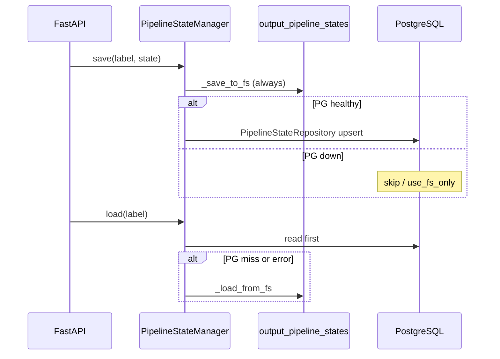
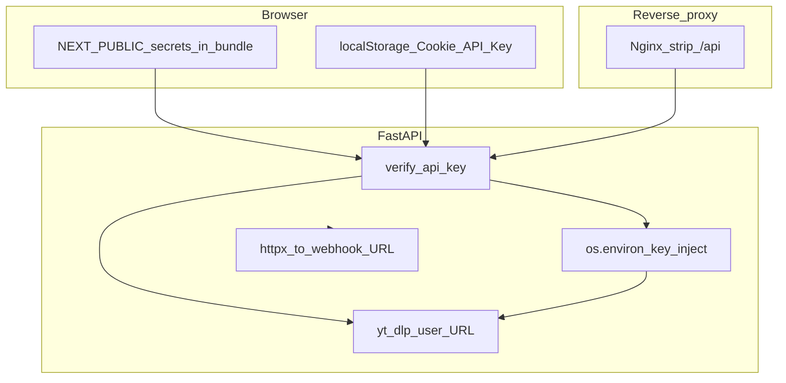

# 本地项目全栈与目录治理深度审计报告

本文档依据仓库内《全栈审计探查计划》完成只读梳理与可验证结论汇总，**不修改业务代码**。详细路由表见 [2026-04-30_audit-api-matrix.md](./2026-04-30_audit-api-matrix.md)。

## 1. 架构快照

- **后端**：[`src/api.py`](../src/api.py) 单体 FastAPI，挂载 LangGraph `compile_pipeline()`、管道并发信号量、线程索引持久化至 **仓库相对** `.../output/.thread_index.json`（**与下文 `VIDEO_OUTPUT_DIR` 可不同步**）；条件挂载 [`api_assets`](../src/api_assets.py)、[`telemetry`](../src/telemetry_endpoint.py)。
- **管线状态**：[`PipelineStateManager`](../src/pipeline/state_manager.py) — **文件 JSON 始终写入**，PostgreSQL **在可用时双写，读优先 PG**。
- **前端**：Next.js App Router（[`web/src/app`](../web/src/app/)），HTTP 客户端与 Demo/生产基址逻辑在 [`web/src/components/api.ts`](../web/src/components/api.ts)。
- **部署**：本地与 Lighthouse 差异见 [`docs/knowledge/local-vs-production-stable.md`](../docs/knowledge/local-vs-production-stable.md)。

### 1.1 状态持久化数据流（StepRunner 场景）

## 2. 阶段 A — 目录与仓库基线

### 2.1 目录健康检查表

| 路径/对象 | 观察 | 风险等级 | 建议 |
|-----------|------|----------|------|
| 根目录 `lute-ai-video-backend.tar`（约 160MB+） | 构建/镜像产物置于仓库根 | 中 | 移入 `tmp/` 或 `archive/`，`.gitignore` 增加 `*.tar`（若不应版本化） |
| 根目录 `PLAN_SPRINT1.md` | 计划类文档在根 | 低 | 与 [`plan/`](../plan/) 其余材料归并，保持根目录极简（项目规则 10-structure） |
| 根目录 `.env` | 本地密钥（`.gitignore` 已忽略） | 低 | 维持不入库；CI 仅用 secrets |
| [`drafts/`](../drafts/) | 当前无草稿文件（或空） | 低 | 继续将一次性文档放 `drafts/` |
| [`tmp/`](../tmp/) | `.gitignore` 忽略 | 低 | 适合临时产物与大文件 staging |
| [`output/`](../output/) | `.gitignore` 忽略 | 低 | 运行时产物；作品集 `list_files` 递归扫描需注意体量 |
| [`deploy/lighthouse/.env.prod`](../deploy/lighthouse/) | 历史 git 状态中曾出现未跟踪生产 env | 高（若误提交） | 确认 `.gitignore` 覆盖 `*.prod` / `.env.prod`；仅用服务器侧管理 |
| [`web/.next/`](../web/) | 构建缓存 | 低 | 勿提交；已在常规前端 ignore |

### 2.2 与文档规则对齐

- 正式知识文档应在 [`docs/`](../docs/) 并带 YAML 头；本报告置于 **`plan/`** 作为审计/路线图产物，与 [`30-docs`](../.cursor/rules/30-docs.mdc) 中「分析 → drafts/analysis」相比，**plan 目录为仓库既有惯例**，可接受；若需升格为正式知识可迁 `docs/architecture/` 并更新链接。

---

## 3. 阶段 B — 后端 API 与安全面

### 3.1 脆弱点登记（严重度）

| ID | 严重度 | 领域 | 描述 | 证据/说明 |
|----|--------|------|------|-----------|
| S1 | **高** | 鉴权 | **`/api/assets` 全路由器无 `X-API-Key`**，与主 API 不一致；含上传、品牌包、网红 CRUD（内存态） | [`api_assets.py`](../src/api_assets.py) 无 `Depends(verify_api_key)` |
| S2 | **中高** | 信息暴露 | **`GET /api/media/...` 无 Key**，便于 `<video>/` 播放，但 **知路径即可拉取**（与列表接口需 Key 形成「列表难、直链易」组合） | [`api.py`](../src/api.py) `serve_media` 装饰器 |
| S3 | **中** | 信息暴露 | **`/telemetry/metrics`、`/telemetry/errors` 无 Key**，可泄露运行期指标与错误摘要 | [`telemetry_endpoint.py`](../src/telemetry_endpoint.py) |
| S4 | **中** | 密钥与注入 | **`pipeline/start` 等请求内 `api_keys` 经 `_inject_api_keys` 写入进程级 `os.environ`**，多租户/并发请求下存在 **密钥交叉污染** 模型（同进程共享） | [`api.py`](../src/api.py) `_inject_api_keys` |
| S5 | **低** | 运维 | **未设置 `API_KEY` 时启动会生成临时 Key 并打日志**，日志管道若外泄则暴露会话鉴权 | [`api.py`](../src/api.py) startup 警告 |
| S6 | **低** | CORS | 默认 `allow_origins` 含通配式条目 `https://*.tcloudbaseapp.com`（Starlette/FastAPI 对 **通配子域** 支持需运行时验证）；生产应用 **`CORS_ORIGINS` 显式列表**更稳 | [`api.py`](../src/api.py) CORSMiddleware |
| S7 | **中高** | 身份与 IDOR | **`thread_id = str(uuid.uuid4())[:8]`** 仅保留约 **32 bit** 随机性（UUID 字符串前 8 位）。反直觉：完整 UUID 看似安全，**截断后熵大减**，高并发下 **碰撞** 风险上升；若配合 **已知的固定 Demo API Key**（[`api.ts`](../web/src/components/api.ts) 默认 `ai_video_demo_2026`），则 **枚举/撞车其它用户 thread** 的模型在威胁建模上不可忽视 | [`api.py`](../src/api.py) `start_pipeline` |
| S8 | **高** | 前端密钥 | **`NEXT_PUBLIC_API_KEY` + localStorage/cookie 存的 `X-API-Key`**：名字带 PUBLIC 易让人误以为可公开，实则会 **进浏览器 bundle / 存储**；任一 **XSS** 或恶意扩展即可窃取。与「后端 API Key 守卫敏感能力」的直觉相反：**前端持有的所谓密钥不是机密** | [`api.ts`](../web/src/components/api.ts) `getApiKey`、`readEnv` |
| S9 | **中** | 可用性/策略 | **限流中间件**：`len(_rate_store) > 1000` 时 **`_rate_store.clear()`** 清空**全体**客户端计数。反直觉：像在做「防爆破」，实则 **一次性丢掉所有慢客户端记录**，攻击者可用大量伪造源 IP **迫使重置**，连带 **误伤正常限流**；且 **`request.client.host`** 在 **反向代理** 后常变为**单一上游 IP**，限流粒度失真 | [`api.py`](../src/api.py) `rate_limit_middleware` |
| S10 | **高** | SSRF | **`VideoDownloader._real_download`** 将用户可控 **`url`** 交给 **`yt-dlp` 子进程**。反直觉：这不是 HTTP 客户端直连，但 yt-dlp 支持多样协议，**`file://`、内网、非 HTTP 方案** 等可构成 **SSRF/读本地文件** 一类风险（取决于版本与选项）；与「只做社交下载」的产品假设不一致 | [`video_downloader.py`](../src/tools/video_downloader.py) |
| S11 | **中** | SSRF | **`WebhookManager.dispatch`** 对注册 URL 仅用 `http(s)` + `httpx.URL` 解析，**无 RFC1918/元数据地址禁入**。若注册入口未来暴露给低信任方（或配置注入），即经典 **对内网/云元数据的回连 SSRF** | [`webhook_manager.py`](../src/tools/webhook_manager.py) |
| S12 | **低** | 稳健性 | **`api_assets` 上传** `metadata: str` 直接 **`json.loads`**，非法 JSON 会 **未捕获则 500**；极大字符串可偏向 **CPU/内存 DoS**（与 multipart 上限并存时需整体评估） | [`api_assets.py`](../src/api_assets.py) |
| S13 | **低** | 供应链 | **DALL·E / GPT Image** 流程对 **供应商返回的 `image_url` 再 `httpx.get`**：正常为 OpenAI CDN；若 **账户/响应被劫持**（极低概率），则变成对 **任意 URL 的二跳抓取**，与「仅信任自家域名」直觉不符 | [`dalle_client.py`](../src/tools/dalle_client.py)、[`gpt_image_client.py`](../src/tools/gpt_image_client.py) |
| S14 | **中高** | 并发 / 计费 | **`_inject_api_keys` 在每次写入 env 后调用 `llm_singleton._clients.clear()`**。反直觉：问题不只是 env 被覆盖，而是 **清空全局 LLM 客户端缓存** 会让 **其它并发请求** 上正在复用的连接/客户端失效，下一调用 **重读全局 `os.environ`**，与「各请求带自己的 Key 就隔离」相反，实为 **进程级共享池上的惊群 + 密钥竞态** | [`api.py`](../src/api.py) `_inject_api_keys`；[`llm_client.py`](../src/tools/llm_client.py) `_clients` |
| S15 | **中** | 完整性 / IDOR | **`output/.thread_index.json` 启动时 `json.load` 后凡 `str` 即写入 `_active_threads`，无签名与来源校验**。反直觉：持久化像「增强可用性」，但若 `output` **权限过宽**、或其它入口可写该文件，则变成 **预植 thread 外壳**；与 S7 短 ID 叠加时 **撞车/误挂载** 面更大；`except: pass` 使 **损坏或篡改文件** 时 **静默无告警** | [`api.py`](../src/api.py) `_restore_thread_index` |
| S16 | **低～中** | 可用性 | **`rate_limit_middleware` 明确跳过 `/health`**。反直觉：health 常被认为「轻协议」，但当前 **`GET /health` 每次实例化 `RemotionRenderer` + `check_pg_health()`**（[`api.py`](../src/api.py) `health`），攻击者可用 **高频打 health** 绕过每 IP 滑窗，消耗 CPU/DB/子进程探测，形成 **侧车型 DoS** |
| S17 | **中** | 部署一致性 | **`_active_threads`、`_rate_store`、`_background_tasks`、Webhook 内存表** 均为 **单进程内存**。反直觉：用 `uvicorn --workers N` 或 K8s 多副本 **横向扩展** 时，**不会共享** 这些结构 → **限流各算各的**、**线程状态落在随机 worker**、**Webhook 注册丢在重启/漂移到别 Pod**。表现为 **间歇 404 /「限流无效」/ 回调丢了**，易被误判为 **前端或网络 flaky** | [`api.py`](../src/api.py)；[`webhook_manager.py`](../src/tools/webhook_manager.py) |
| S18 | **高** | 路径割裂 / 数据分叉 | **`_THREAD_INDEX_PATH = Path(__file__).parent.parent / "output" / ".thread_index.json"`** 固定为 **仓库下 `output/`**，而管线 FS 与作品集根目录使用 [`config.OUTPUT_DIR`](../src/config.py)（`VIDEO_OUTPUT_DIR` 可指向挂载卷）。反直觉：运维以为 **只改 `VIDEO_OUTPUT_DIR` 就整体迁移产物目录**，实际上 **thread 索引仍写旧路径** → 重启后 **持久 thread 列表与真实 `pipeline_states`/媒体根** 可能 **不一致** | [`api.py`](../src/api.py)；[`state_manager.py`](../src/pipeline/state_manager.py) |
| S19 | **中高** | 镜像与仓库布局 | **[`Dockerfile.backend`](../Dockerfile.backend) / 根 [`Dockerfile`](../Dockerfile)** 仅 `COPY src`、`scripts`、`pyproject.toml`，**不包含** 仓库根目录的 [`rendering/`](../rendering/) 与 [`strategy_source/`](../strategy_source/)。反直觉：**本地全仓库跑** 与 **精简后端镜像跑** 不是同一产品：● **Remotion**：`health` 里 `validate_environment()` 会报 **无 Node/无渲染目录**（功能性降级但噪声大）；● **策略场景**：[`strategy.py`](../src/agents/strategy.py)、[`routing.py`](../src/graph/routing.py) 对 `strategy_source` **try/except 吞掉**，云上可能 **静默失去** 场景 prompt / 阈值 / 审核权重，仅留 **warning 日志**，易被当成 **「模型变差」** 而非部署漏文件 | 见上述路径 |
| S20 | **中** | 前端基址 | **[`getApiBase()`](../web/src/components/api.ts)**：仅当 `window.location.hostname === "localhost"` 时用相对 `/api`（非 localhost 生产域）。**`127.0.0.1`、内网 IP、自定义 hosts** 不等于 `localhost`，会落入 **`NEXT_PUBLIC_API_BASE_URL` 或硬编码 `http://localhost:8001`**。反直觉：浏览器打开 `127.0.0.1:3001` 时，前端可能去连 **`localhost:8001` 的另一套网络命名空间**（容器/宿主）导致 **偶发连不上**，与「和本地一样能跑」相悖 | [`api.ts`](../web/src/components/api.ts) |
| S21 | **低～中** | 默认回环假设 | **[`REDIS_URL`](../src/config.py)** 默认 `redis://localhost:6379/0`；**CORS** 默认含多个 `localhost` 端口；**`.env.example`** 的 DB 指向 `localhost:5432`。云上若 **未逐项覆盖 env**，错误往往是 **Connection refused** 或 **跨域**，而非缺文件那样直观 | [`config.py`](../src/config.py)；[`api.py`](../src/api.py) CORS 块 |
| S22 | **低** | 构建期写死 | **[`web/next.config.ts`](../web/next.config.ts)** `repoName = "Lute_AI_Video"` 绑定 gh-pages `assetPrefix`/`basePath`；fork 或改名仓库时 **易产错误静态资源路径**。**[`translations.ts`](../web/src/i18n/translations.ts)** Toast 写死 **`:8001`**，与生产 **相对 `/api` 无端口** 的直觉不一致 | 见路径 |

### 3.2 深度说明（为何「反直觉」）

- **列表需 Key、媒体不需 Key**：攻击者无需列举接口，只要 **猜到/漏出文件名或相对路径**（日志、截图、前端 Network、协作剪贴板）即可 **拖库式拉媒体**；与「有 API Key 就安全」的直觉相反，**机密性依赖路径隐蔽**而非鉴权。
- **密钥写 `os.environ`**：多请求 **并发** 时，后到的 `api_keys` **覆盖** 全局 LLM/供应商 Key，表现为 **偶发「用了别人的 Key」或计费串号」**，难于复现，易被误判为 **供应商不稳定**。
- **`thread_id` 短 ID**：8 位十六进制更像「日志友好 token」，易被当成「无猜解价值」；实际在 **共享 Demo Key** 的演示/内网部署中，**安全边界主要在 Key**，短 ID 放大 **撞车与误关联** 面。
- **`_clients.clear()`**：单次请求改 Key 会 **拆掉所有人正在用的连接池**；在异步并发下，这与「HTTP 请求边界 = 安全边界」的直觉相悖，更接近 **多线程写全局单例** 的经典坑。
- **Thread 索引文件**：将「谁有过 thread」信任 **等价于信任 `output` 目录完整性**；若未在威胁模型里写明，运维给容器挂宽权限卷时容易 **无意识扩大信任根**。
- **多 worker**：单机加进程 **不一定** 提高正确性，可能把 **本应单体的会话状态** 切成 **不可见的分片**；调试时若在错 worker 上查 thread，会得到 **与代码无关的偶发失败**。
- **「改一个 env 就搬家」**：`VIDEO_OUTPUT_DIR` 与 **thread 索引路径** 未统一时，云上迁盘表现为 **一半状态在新卷、一半仍在仓库内 `output/`**，排查难度大。
- **精简镜像 ≡ 丢能力**：`strategy_source` 缺失不会立刻 ImportError 崩全盘，而是 **悄悄用空配置**；这比「启动失败」更危险，因为 **监控仍绿、业务已偏**。

### 3.3 优化建议（安全）

| 优先级 | 动作 | 验收标准 |
|--------|------|----------|
| P0 | 为 `api_assets.router` 增加与主应用一致的 API Key（或 mTLS / 内网 only），上传限流 | 未授权 `POST /api/assets/upload` 返回 401 |
| P0 | **`thread_id` 使用完整 UUID**（或加密随机 128bit+），并校验 path 参数格式 | 无 8 位 hex 短码；异常格式 400 |
| P0 | **yt-dlp / 下载层 URL 白名单**：禁止 `file://`、内网段、元数据 IP；或独立不可信网络沙箱 | 恶意 URL 单元测试失败且不触网内 |
| P0 | **Webhook 出站 URL 校验**：拒绝私有/保留地址（含 IPv6），与 SSRF 策略统一 | 注册 `http://169.254.169.254` 失败 |
| P0 | **废除 `NEXT_PUBLIC_API_KEY` 承载真密钥**：演示用固定 Key 仅文档说明；生产用 **HttpOnly Cookie / BFF 代发** 或 **短时 token** | 浏览器存储中无明文长期管理员 Key |
| P1 | **明确媒体策略**：接受「匿名可读」则文档化；否则短期 token / signed URL + `getMediaUrl` 配套 | 威胁模型文档 + 配置开关 |
| P1 | **限流重写**：代理后读 **可配置可信头的客户端 IP**；**禁止全局 clear**，改用 **LRU/TTL 单桶** | 高压伪造 IP 下合法用户不误杀 |
| P1 | **`_inject_api_keys` 改为请求/任务上下文**（`contextvar` 或显式传参），禁止进程级覆盖 | 并发回归测试互不影响 |
| P1 | **禁止在注入路径上 `clear()` 全局 LLM 客户端**；改为 **按 Key 哈希分桶的 client 缓存** 或 **每任务显式 client**，避免波及其他请求 | 双并发不同 Key 请求下计费主体不乱 |
| P1 | **`_THREAD_INDEX_PATH` 完整性**：权限收紧（仅服务户可写）、可选 **HMAC/签名** 或 **迁 DB**；加载失败 **结构化告警** 而非静默 | 篡改文件时在监控中可见 |
| P1 | **`_THREAD_INDEX_PATH` 与 `OUTPUT_DIR` 同源**：禁止写死仓库子路径 `.../output/`，与 `VIDEO_OUTPUT_DIR` 派生的根一致（闭 **S18**） | 换云盘仅改一处 env，索引与 state/媒体不分裂 |
| P1 | **Health 与限流**：对 `/health` 使用 **更宽松配额** 而非 **完全豁免**，或拆 **`/health/live`（极简）** / **`/health/ready`（可重）** | 压测 health QPS 下 CPU 不明显高于基线 |
| P1 | **部署文档化**：若坚持多 worker，**sticky session** 或 **thread/API 状态外置 Redis/Postgres**；否则 **单 worker + 外层扩展** | 负载下 pipeline 轮询接口不随机 404 |
| P2 | Telemetry 默认仅本机或需 Key；生产由 Nginx `location` 限制 | `curl` 外网不可达或 401 |
| P2 | `api_assets` `metadata`：**大小上限 + try/except JSON** + schema 校验 | 畸形 JSON 400 非 500 |

### 3.4 硬编码、硬路径与云部署扩展性（专项）

| 类别 | 位置（事实） | 云上典型症状 | 建议优先级 |
|------|----------------|--------------|------------|
| **可写根不一致** | `VIDEO_OUTPUT_DIR` vs [`api.py`](../src/api.py) `_THREAD_INDEX_PATH` 固定 `.../output/` | 换卷后 thread 恢复错目录、或与 `pipeline_states` 分裂 | **P0～P1**：索引路径 **derive from 同一 OUTPUT_DIR** |
| **镜像 COPY 范围** | [`Dockerfile.backend`](../Dockerfile.backend) 无 `strategy_source/`、`rendering/` | 策略/审核阈值与本地不一致；Remotion 永久「不可用」 | **P1**：镜像增加 COPY 或 **启动时校验** 缺失关键目录并 **fail-fast / 结构化降级标志** |
| **仓库耦合路径** | [`remotion_renderer.py`](../src/tools/remotion_renderer.py) `RENDERING_DIR = .../rendering` | 非「整仓」布局即无法渲染 | **P1**：`REMOTION_ROOT` env；或文档声明 **仅 worker 镜像打包渲染** |
| **import 时 mkdir** | [`config.py`](../src/config.py) `OUTPUT_DIR.mkdir(exist_ok=True)` | 只读根文件系统 / 错误挂载权限时 **import 即崩** | **P2**：延迟到首次写入或显式启动检查 |
| **前端 host 特判** | [`api.ts`](../web/src/components/api.ts) 仅 `localhost` → `/api` | `127.0.0.1`/内网 IP 开发或预发布 hostname **误走默认 8001** | **P1**：特判 `127.0.0.1` / 可配置「视为同源代理」 |
| **默认 localhost 依赖** | Redis / DB 示例 / CORS 默认 | 首云上线路 **一连串 refused** | **P2**：部署清单逐项 env + **启动预检** 打印缺失项 |

**自检命令（运维可照做）**

1. 容器内：`python -c "from pathlib import Path; import src.api"`（若自定义 `VIDEO_OUTPUT_DIR`，核对是否仍存在 **仓库内** `output/.thread_index.json` 被写入）。  
2. 容器内：`test -d /app/strategy_source`（当前 [`Dockerfile.backend`](../Dockerfile.backend) 布局下通常为 **否** → 与本地行为差）。  
3. 浏览器分别用 `http://localhost:3001` 与 `http://127.0.0.1:3001` 打开，核对 Network 里 API base 是否一致。

---

## 4. 阶段 C — 管线、并发与存储

### 4.1 风险与不一致场景

| 场景 | 说明 | 建议 |
|------|------|------|
| PG 短暂不可用 | **写 FS 成功、写 PG 失败**时，读仍可能先 PG 再回落 FS；若 PG 部分写入与 FS 分叉，需运维以 FS 或 PG 之一为准 | 健康检查 UI/API 明示 `persistence.backend`；文档化恢复流程 |
| `api_keys` 注入 | 并发两个请求带不同第三方 Key，后写入覆盖 `os.environ` | 长期：按 `thread_id`/上下文传参而非全局 env；短期：文档警告单用户实例 |
| LangGraph 大文件 [`api.py`](../src/api.py) | 路由与业务偶合，审查与回归成本高 | 渐进拆 `routers/pipeline.py`、`routers/scenarios.py` |
| 场景配置缺失（镜像） | `strategy_source` 未进后端镜像时 **静默降级**（见 **S19**） | 发布 checklist：镜像含 `strategy_source` 或 **显式告警 metrics** |

### 4.2 并发控制

- **`_pipeline_semaphore = asyncio.Semaphore(10)`**：限制同时 `astream` 管线数；饱和时后续请求阻塞等待，需监控超时与 HTTP 层队列。
- **`_background_tasks`**：任务表需防内存无限增长（清理完成/失败任务策略建议在负载下复查）。

---

## 5. 阶段 D — 前端与契约

| 项 | 状态 | 说明 |
|----|------|------|
| `getApiBase()` | 已对齐本地 `http://localhost:8001` 与生产 `/api` | 与 Nginx 剥前缀行为一致时需保持路径约定 |
| `getFilesListUrl()` / `getMediaUrl()` | 已区分绝对 base 与 `/api` 前缀 | 避免 Next dev 误打 3000 端 `/api/files` |
| `next.config.ts` | `DEPLOY_TARGET` 驱动 `standalone` vs `export` | 与 `deploy/lighthouse` 宿主机构建流程一致，避免混用 export 产物跑 SSR 期望 |
| `web/src/i18n/translations.ts` | 当前 **tsc --noEmit 通过** | 历史曾报 duplicate key；建议 CI 跑 `tsc` 防止回归 |
| 页面矩阵 | `page.tsx`（主台）、`footage`、`brand-packages`、`influencers` | 与 `api_assets`、场景 API 的边界需在 PR 中随功能更新契约 |
| **密钥存储** | **脆弱默认** | `SameSite=Lax` **Cookie** 与 **localStorage** 保存 API Key，**非 HttpOnly**；与第三方脚本/ XSS 面叠加后 **凭据窃取** 风险高于「仅 HTTPS」的直觉 |
| **API base 与 host** | **扩展性坑** | 见 **S20**：`127.0.0.1` ≠ `localhost` 时易误用 `http://localhost:8001`；Toast 写死 `:8001`（**S22**）易误导生产排障 |

### 5.1 架构层「信任边界」示意图（更新）

### 5.2 `list_files` 与符号链接（阶段 C 补充）

- **`OUTPUT_DIR.rglob("*")`**：在部分 Python/平台上 **符号链接** 行为需实测（循环链接、穿透至仓库外挂载）。反直觉：**「只扫 output」** 仍可能因 **symlink 指到敏感路径** 而扩大读面；`serve_media` 虽 `resolve()` + `relative_to`，**列举阶段**已泄露存在性。
- **建议**：显式 **`follow_symlinks=False`**（若运行时支持）或 **跳过 symlink 文件**；或在部署层 **禁止 output 内用户可控 symlink**。

---

## 6. 阶段 E — 测试、可观测性、运维

### 6.1 测试覆盖（抽样事实）

- [`tests/`](../tests/) 下 **约 37** 个 `test_*.py` 文件（含 `test_api.py`、`test_asset_library.py`、`test_s1_e2e.py` 等），**并非**仅 `conftest` + `run_track3_tests`。
- **缺口（加深）**：当前几乎必然 **缺少**：
  - **并发两请求 `api_keys` 注入** 的交错断言；
  - **yt-dlp / webhook** 的 **SSRF 负例**（`file://`、`169.254.169.254`、内网段）；
  - **限流 store 满** 时的 **非全局失效** 行为；
  - **短 thread_id 碰撞** 统计或 fuzz（可选）；
  - **双并发请求不同 `api_keys`**：断言 **LLM/供应商调用** 使用的密钥上下文 **互不污染**（覆盖 S14）；
  - **篡改/截断 `.thread_index.json`**：启动或热路径行为 **可观测**（覆盖 S15）；
  - **`/health` 压测**：豁免路径下 **延迟与 CPU** 预算（覆盖 S16）；
  - **多 worker / 多副本** 下 **同一 `thread_id` 轮询** 行为（覆盖 S17）。
  - **自定义 `VIDEO_OUTPUT_DIR`** 下 **thread 索引是否仍落在旧路径**（覆盖 S18）。
  - **最小后端镜像**（无 `strategy_source`）对比 **全仓库**：策略输出/阈值差异（覆盖 S19）。
  - **前端以 `127.0.0.1` 打开** 时 API 基址是否与 `localhost` 一致（覆盖 S20）。
- 建议优先级：**api_assets 鉴权**、**媒体路径**、**双写一致性**、**SSRF 单测套件**。

### 6.2 健康与部署

- `/health` 返回 `remotion`、`persistence`（含 `check_pg_health`），利于探针与会诊。
- Lighthouse 经验见 [`docs/knowledge/deploy-lessons-learned-stable.md`](../docs/knowledge/deploy-lessons-learned-stable.md)（`HOSTNAME`、`wget 127.0.0.1`、compose 同步等）。

### 6.3 发布前校验清单（建议增量）

1. `curl` `/health` 与 `/api/health`（生产经 Nginx）均为 200。
2. 随机带 Key 调 `GET /api/files`，不带 Key 调 `GET /api/media/合法路径` 行为符合产品预期。
3. **有意**请求 `GET /api/assets/brand-packages`：若已加鉴权则 401。
4. **`VIDEO_OUTPUT_DIR` 非默认时**：确认 **不存在** 另一份 `项目根/output/.thread_index.json` 仍在增长（闭 **S18**）。
5. **后端容器**：若依赖场景策略，确认镜像内存在 `strategy_source` 或接受 **显式降级**（闭 **S19**）。
6. `docker ps` 全 healthy（若适用）。

---

## 7. 阶段 F — 综合优化路线图（非安全 + 深化）

| 优先级 | 主题 | 动作 | 验收 |
|--------|------|------|------|
| P0 | 安全/SSRF | 见 **§3.3** P0（yt-dlp、Webhook、`thread_id`、前端密钥模型） | 对应单测 + 手工 `curl` |
| P1 | 可维护性 | 拆分 `api.py` 为多个 router 模块 | 单文件行数下降、OpenAPI 标签清晰 |
| P1 | 性能 | `list_files`：`rglob` → **增量索引/分页**，或后台任务维护 manifest；**跳 symlink** | 万级文件不阻塞事件循环；无越界读 |
| P1 | 限流 | 替换全局 `clear` 为 **分桶 LRU**；**可信 forwarded-for** | 代理后仍有效 |
| P1 | 并发与缓存 | **按上下文绑定 Key**，避免 `_clients.clear()`；见 §3.3 | 无双请求串 Key 复现 |
| P1 | 运维面 | **Health 分层 + 低配额**；**thread 索引**审计与告警 | S16/S15 闭项 |
| P1 | 扩展模型 | **多 worker 须外置状态或 sticky**；文档与 Helm/Compose 对齐 | S17 不表现为随机失败 |
| P1 | 路径与镜像 | **§3.4**：统一 thread 索引与 `VIDEO_OUTPUT_DIR`；**Dockerfile 纳入 `strategy_source`** 或启动 **硬失败/显式 flags**；`REMOTION_ROOT` 可配置 | 自定义卷与精简镜像 **行为与本地对齐** |
| P1 | 前端可移植 | **`127.0.0.1` / 内网 host** 与生产 `/api` 规则一致化；Toast **不写死端口** | S20/S22 闭项 |
| P2 | 工程化 | `*.tar`、根目录散乱计划文件治理 | 根目录符合 10-structure |
| P2 | 观测 | 统一 structlog/json 日志字段 + trace_id | 与 `_safe_error` trace 对齐 |
| P2 | 隐私 | 日志中对 **用户 URL、密钥头部** 做脱敏 | grep 日志无完整 `sk-` |

---

## 8. 结论（更新）

- **架构**清晰，但 **信任边界被多处「开发便利」稀释**：前端 **`NEXT_PUBLIC_*` / 存储中的 Key**、**短 `thread_id`**、**进程级 `_inject_api_keys` + 全局 LLM 池 `clear`**、**无鉴权的资产与遥测路由**、**出站/子进程 URL**、**可写的 thread 索引与「重 health」面**、**多进程部署与内存态假设错位**、以及 **`VIDEO_OUTPUT_DIR` / thread 索引 / 前端 host 特判 / 后端镜像 COPY 范围** 等 **硬路径与默认 localhost 心智** 共同构成 **非显而易见** 的 Exploit、**稳定性** 与 **云上首 deploy 排障** 坑。
- **目录**：根目录 **大 tar** 与散落 **计划 MD** 与项目结构规则存在偏差，建议归档。
- **下一步（按收益排序）**：1）**`api_assets` + telemetry + 媒体** 的 **统一鉴权/网络隔离决策**；2）**SSRF 硬化**（yt-dlp、Webhook、可选 image 二跳）；3）**Key、LLM 客户端与 thread 标识模型**（完整 UUID + **禁止**注入路径清空全局 client + 禁止真密钥进 PUBLIC 包）；4）**限流 + health 策略修订**；5）**部署契约**：单 worker vs 外置状态 **写死并检测**，避免 S17 类「幽灵故障」；6）**路径与镜像契约（§3.4）**：消除 **`VIDEO_OUTPUT_DIR` 与 thread 索引分叉**、补齐或显式降级 **`strategy_source`/Remotion**、修正 **前端非 `localhost` hostname** 与 **文案写死端口**。

附录：[API 矩阵与安全备注](./2026-04-30_audit-api-matrix.md)
